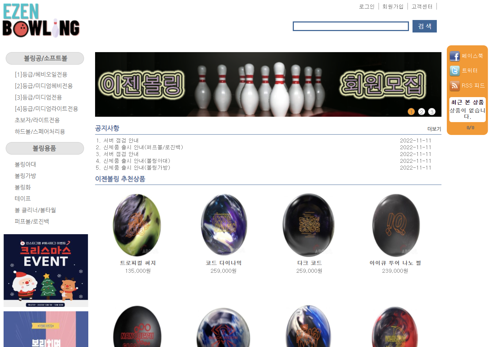
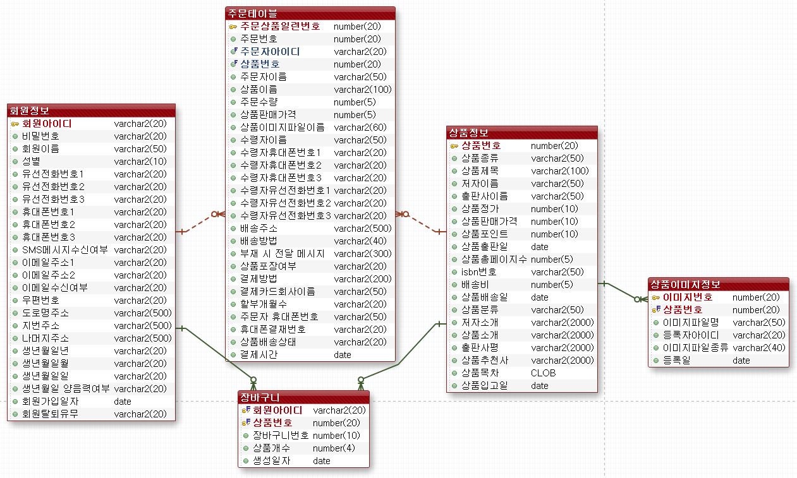

# EZEN Bowling(볼링공 및 볼링 용품 판매 사이트)

## 프로젝트 목적
* 현 시대에는 온라인 구매가 활성화되어 있음
* 특정 분야와 관련된 구매자의 니즈를 더 확실히 충족시키기 위해 특정 종류의 제품들을 전문적으로 판매하는 쇼핑 사이트가 필요
* 이에 따라 볼링으로 분야를 정한 후 볼링을 하는 사람들을 위한 볼링 용품을 전문적으로 판매하는 쇼핑 사이트 개발

## 개발 일정
2021년 11월 1일 ~ 2021년 11월 25일

## 구현 기능
| 기능 | 내용 | 
| ------ | ------ | 
| 회원가입 | 회원가입, 회원탈퇴 | 
| 회원기능 | 상품 구매, 장바구니 |
| 관리자기능 | 상품관리, 주문관리, 회원관리, 공지사항관리 |
| 마이페이지 | 주문내역/배송 조회, 회원정보관리 |
| 상품조회 | 추천상품, NEW 상품, BEST 상품 |
| 상품정보 | 상세정보, 회사소개 |
| 사이트정보 | 회사소개, 이용약관, 개인정보취급방침 |

## 개발 환경 및 도구
| | |
| ----- | ------ |
| OS | Windows 10 (x64) |
| 프레임워크 | Spring Framework 4.3.2 |
| 서버 | Apache Tomcat 9.0 |
| 언어 | Java 11(Azul Zulu) |
| DBMS | MariaDB 10.7 |
| 개발환경 | IntelliJ IDEA, Visual Studio Code |

## 호스팅 서버 정보
| | |
| ----- | ------ |
| 서비스 제공 업체 | AWS(Amazon Web Service) |
| OS | Ubuntu |

## 라이브러리
* mariadb-java-client-2.4.1
* mysql-connector-java-5.1.29
* tiles-core-2.2.2
* jquery-2.2.1
* mybatis-3.1.0
* mybatis-spring-1.1.0
* commons-beanutils-1.8.0
* commons-logging-1.1.1
* commons-dbcp-1.2.2
* commons-pool-1.3
* spring-jdbc-3.1.1.RELEASE

## ERD
